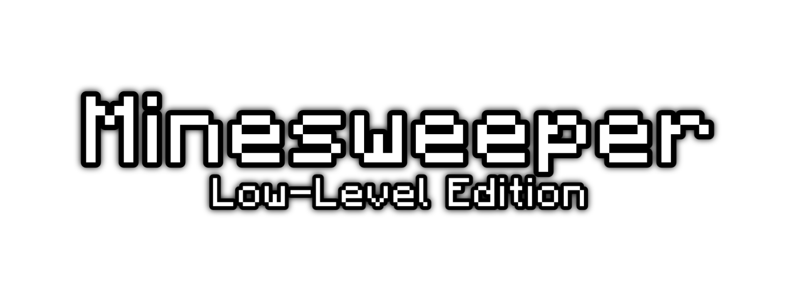
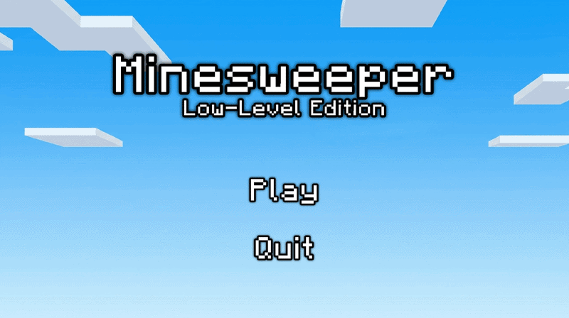

  

  ### Source code gry zrobionej na przedmiot Programowanie Niskopoziomowe.
   

  )
  

  
  

---

### ⬇️ Pobieranie gry
Najnowszy plik ZIP z grą skompilowaną w pełni automatycznie na systemy **Windows** oraz **Linux** (dzięki GitHub Actions) znajdziesz w zakładce **[Releases](../../releases)**.

---

### 📂 Struktura plików

- `main.c` - Główna pętla programu i nasłuchiwanie eventów.
- `logic.c` & `logic.h` - Cała logika gry.
- `ui.c` & `ui.h` - Cała logika interfejsu.
- `io.c` & `io.h` - Zapisywanie logów oraz zapis i odczyt stanu gry z pliku .json.
- `assets/` - Wszystkie graficzne i tekstowe zasoby gry.

---

### 📜 Użyte zasoby i biblioteki

* **Niektóre tekstury:** [Futureazoo/TextureRepository](https://github.com/Futureazoo/TextureRepository).
* **Czcionka:** [IdreesInc/Minecraft-Font](https://github.com/IdreesInc/Minecraft-Font).
* **Silnik graficzny:** [Allegro 5](https://liballeg.org/).
* **Format JSON:** [DaveGamble/cJSON](https://github.com/DaveGamble/cJSON).

---

### 🐛 Znalazłeś/aś buga lub masz pytanie?
Możesz śmiało otworzyć [Issue](../../issues/new "Kliknij tutaj, aby otworzyć nowy Issue."), jeśli natrafisz na jakiegoś buga albo po prostu masz pytanie dotyczące tego repozytorium.
